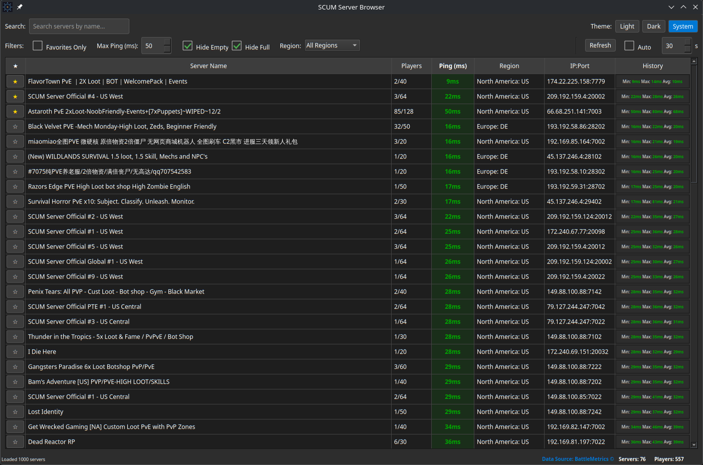

# SCUM Server Browser

A lightweight desktop application for tracking and pinging SCUM game servers with real-time latency monitoring.

**Built with PyQt6 | Cross-Platform | Self-Contained | No Dependencies**


*SCUM Server Browser running on Linux with dark theme*

## 🚀 Quick Start

### Download & Run (Recommended)

No Python installation needed! Download the executable for your platform:

- **Linux**: Download from [Releases](https://github.com/crashman79/scum-server-browser/releases)
  ```bash
  tar -xzf SCUM_Server_Browser-Linux.tar.gz
  ./SCUM_Server_Browser
  ```

- **Windows**: Download from [Releases](https://github.com/crashman79/scum-server-browser/releases)
  ```
  Double-click SCUM_Server_Browser.exe
  ```

That's it! Everything is bundled inside the executable.

### Or Run From Source

If you have Python 3.8+:

```bash
pip install -r requirements.txt
python -m scum_tracker
```

## ✨ Features

- 🌐 **Browse SCUM Servers** - Real-time list from BattleMetrics API
- ⏱️ **Ping Monitoring** - Measure latency to any server
- ⭐ **Favorites** - Mark and filter your favorite servers
- 📊 **Ping History** - Track latency trends over time
- 🔍 **Search & Filter** - Find servers by name, region, or player count
- 🎨 **Themes** - Light, Dark, or System theme support
- 💾 **Persistent Settings** - Filters and preferences saved automatically
- 🚀 **Async Operations** - Responsive UI during network operations

## 📋 How to Use

1. **Browse Servers** - Application loads SCUM servers on startup
2. **Search** - Use the search box to find servers by name
3. **Filter** - Filter by region, ping, or player count
4. **Ping** - Right-click any server to ping it
5. **Favorite** - Click the ⭐ to mark servers as favorites
6. **Auto-Refresh** - Servers refresh automatically (configurable interval)

## 🛠️ Development

### Project Structure

```
scum-browser/
├── .github/workflows/
│   └── build-windows.yml    # Automated Windows build (GitHub Actions)
├── scum_tracker/
│   ├── __init__.py           # App initialization & entry point
│   ├── __main__.py           # CLI entry point
│   ├── assets/
│   │   └── app_icon.png      # Application icon
│   ├── models/
│   │   ├── server.py         # GameServer & PingRecord data models
│   │   └── database.py       # SQLite database (favorites, history, settings)
│   ├── services/
│   │   ├── server_manager.py # BattleMetrics API client
│   │   ├── ping_service.py   # Ping functionality (ICMP, TCP fallback)
│   │   ├── location_analyzer.py # Server location detection
│   │   └── theme_service.py  # Light/Dark theme management
│   └── ui/
│       └── main_window.py    # PyQt6 main window & application logic
├── build_linux.sh            # Build script for Linux executable
├── build_windows.bat         # Build script for Windows executable
├── SCUM_Server_Browser.spec  # PyInstaller configuration
├── requirements.txt          # Runtime dependencies
├── requirements-build.txt    # Build dependencies (PyInstaller)
└── README.md                 # This file
```

### Building Standalone Executables

To create self-contained executables:

**Linux:**
```bash
chmod +x build_linux.sh
./build_linux.sh
# Output: dist/SCUM_Server_Browser (146 MB)
```

**Windows:**
```cmd
build_windows.bat
REM Output: dist\SCUM_Server_Browser.exe (146 MB)
```

Automated builds also run on GitHub Actions - check the [Actions](https://github.com/crashman79/scum-server-browser/actions) tab for the latest Windows executable.

### Performance Optimizations

The application includes several Windows-specific optimizations for better performance:

- **Connection Pooling**: HTTP requests use connection pooling to reduce latency
- **Socket Optimizations**: TCP sockets configured for faster ping operations
- **Database Tuning**: SQLite configured with WAL mode for better concurrency
- **Thread Management**: Optimized cleanup for reliable operation on Windows
- **High-DPI Support**: Automatic scaling on high-resolution displays

For detailed information, see [WINDOWS_OPTIMIZATIONS.md](WINDOWS_OPTIMIZATIONS.md).

### Data Storage

- **Location**: `~/.scum_tracker/data.db` (SQLite database)
- **Tables**:
  - `favorites` - Marked servers
  - `ping_history` - Ping records with timestamps (7-day retention)
  - `settings` - User preferences (filters, theme, etc.)
- **Performance**: Indexed queries, WAL journaling mode

## 🤝 Contributing

Found a bug or have a feature request? Please open an [Issue](https://github.com/crashman79/scum-server-browser/issues).

Want to contribute code? Feel free to fork and submit a Pull Request!

## 📝 License

This project is open source and available under the MIT License.

## 🙏 Credits

- Server data provided by [BattleMetrics](https://www.battlemetrics.com)
- Built with [PyQt6](https://www.riverbankcomputing.com/software/pyqt/)
- Packaged with [PyInstaller](https://pyinstaller.org/)

## ⚙️ System Requirements

### For Executable Users
- **Linux**: Any x86_64 system, 512 MB RAM, 300 MB disk space
- **Windows**: Windows 7 SP1+ (Windows 10/11 recommended), 512 MB RAM, 300 MB disk space
- **No Python installation required**

### For Developers
- Python 3.8+
- pip (Python package manager)
- Virtual environment (recommended)

## Troubleshooting

**ImportError: No module named 'PyQt6'**
```bash
pip install -r requirements.txt
```

**Slow performance on Windows**
- Ensure Windows Firewall allows the application
- Check if antivirus is scanning network traffic (add exception)
- Close other applications using network resources

**Ping not working**
- TCP connection method used (no admin rights needed)
- Check firewall settings if all pings fail
- Some servers may have connection restrictions

**Database issues**
- Database file is stored in `~/.scum_tracker/data.db`
- Safe to delete to reset favorites and history
- Automatic cleanup after 7 days of ping history

## Future Enhancements

- [ ] Additional server filters (game mode, rules)
- [ ] Real-time server monitoring
- [ ] Export server data to CSV
- [ ] Server status notifications
- [ ] Custom server list import

## License

MIT
