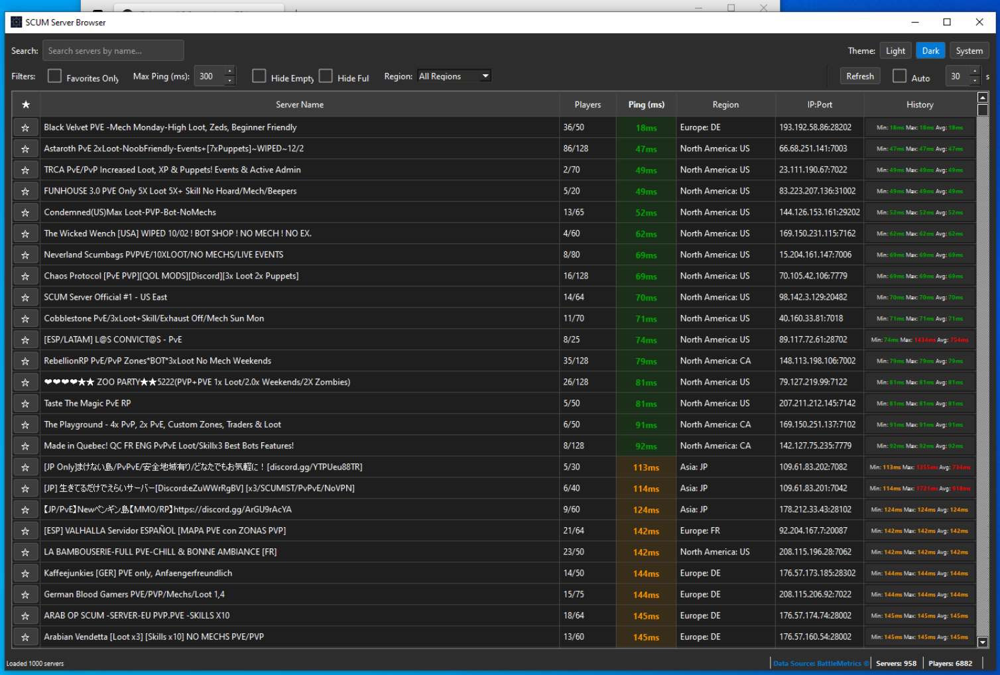

# SCUM Server Browser

A lightweight desktop application for tracking and pinging SCUM game servers with real-time latency monitoring.

**Built with PyQt6 | Cross-Platform | Self-Contained | High Performance**


*Linux version with dark theme*


*Windows version with dark theme*

## 🚀 Quick Start

### Download Pre-built Executables

**No Python installation needed!** Download from [Releases](https://github.com/crashman79/scum-server-browser/releases/latest)

**Windows:**
```cmd
# Extract SCUM_Server_Browser-Windows.zip
# Double-click SCUM_Server_Browser.exe
```

**Linux:**
```bash
tar -xzf SCUM_Server_Browser-Linux.tar.gz
cd SCUM_Server_Browser-Linux

# Option 1: Run directly (portable)
./SCUM_Server_Browser

# Option 2: Install to system (adds to application menu)
./install.sh

# Option 3: Self-install from GUI (File → Create Desktop Entry)
# Run the app and use the menu option

# Option 4: Self-install from command line
./SCUM_Server_Browser --install-desktop
```

The executable can create its own desktop entry! Use the GUI menu **File → Create Desktop Entry** or run with `--install-desktop` flag.

### Install From Source (Linux)

For development or to install from source with application menu integration:

```bash
# Clone or download the repository
git clone https://github.com/crashman79/scum-server-browser.git
cd scum-server-browser

# Run the source installer
./install.sh
```

This will:
- Install to `~/.local/share/scum-server-browser`
- Create a Python virtual environment with dependencies
- Add `scum-server-browser` command to your PATH
- Create an application menu entry (Games category)
- Install application icons

To uninstall: `~/.local/share/scum-server-browser/uninstall.sh`

### Run From Source

Requires Python 3.8+:

```bash
pip install -r requirements.txt
python -m scum_tracker
```

## ✨ Features

- 🌐 **Server Discovery** - Automatic server list from BattleMetrics API
- ⚡ **Real-time Ping Updates** - See latency as servers respond (250ms refresh)
- ⏱️ **Fast Pinging** - Optimized TCP connections with socket tuning
- ⭐ **Favorites** - Mark and quickly filter your favorite servers
- 📊 **Ping History** - Track latency trends with statistics (min/max/avg)
- 🔍 **Advanced Filters** - Search by name, region, ping, player count
- 🎨 **Theme Support** - Light, Dark, or System theme
- 💾 **Persistent Settings** - Your preferences are automatically saved
- 🚀 **High Performance** - Connection pooling, database optimization, async operations

## 🎯 What's New in v1.0.1

- **Real-time updates** - Ping results appear instantly as servers respond
- **50-60% faster** server loading with HTTP connection pooling
- **30-40% faster** pings with socket optimizations
- **Progress indicator** - See "Pinging servers... X/Y" live counter
- **Windows optimizations** - High-DPI support, better reliability
- **Database performance** - WAL mode, indexes for faster queries

See [CHANGELOG.md](CHANGELOG.md) for full details.

## 🛠️ Development

### Building Executables

**Linux:**
```bash
chmod +x build_linux.sh
./build_linux.sh
```

**Windows:**
```cmd
build_windows.bat
```

Automated builds run via GitHub Actions on tagged releases.

### Performance Features

This application includes several optimizations for speed and reliability:

- **Connection Pooling** - Reuses HTTP connections for 50-60% faster API calls
- **Socket Tuning** - TCP_NODELAY and SO_REUSEADDR for 30-40% faster pings
- **Database Optimization** - WAL mode, indexed queries, 7-day auto-cleanup
- **Real-time Updates** - 250ms refresh for immediate visual feedback
- **Platform-specific** - Optimized batch sizes and timeouts per OS

See [WINDOWS_OPTIMIZATIONS.md](WINDOWS_OPTIMIZATIONS.md) for technical details.

### Project Structure

```
scum_tracker/
├── models/       # Data models (Server, PingRecord, Database)
├── services/     # Business logic (API, Ping, Theme)
├── ui/           # PyQt6 interface
└── assets/       # Icons and resources
```

## 💾 Data Storage

- **Location**: `~/.scum_tracker/data.db` (SQLite)
- **Auto-cleanup**: Ping history older than 7 days
- **Optimized**: WAL mode, indexed queries
- **Safe to delete**: Removes all favorites and history

## ⚙️ System Requirements

**Pre-built Executables:**
- **Windows**: 7 SP1+ (10/11 recommended), 512 MB RAM, 300 MB disk
- **Linux**: x86_64, 512 MB RAM, 300 MB disk

**From Source:**
- Python 3.8+
- pip and virtualenv recommended

## 🐛 Troubleshooting

**Slow Performance**
- Allow app through firewall/antivirus
- Close other network-intensive applications
- See [WINDOWS_OPTIMIZATIONS.md](WINDOWS_OPTIMIZATIONS.md) for tuning

**Connection Issues**
- Uses TCP connections (no admin/root needed)
- Check firewall if all servers fail to ping
- Some servers may restrict connections

**Database Issues**
- Delete `~/.scum_tracker/data.db` to reset
- Automatic 7-day cleanup maintains performance

## 🙏 Credits

- Server data: [BattleMetrics API](https://www.battlemetrics.com)
- Built with: [PyQt6](https://www.riverbankcomputing.com/software/pyqt/)
- Packaged with: [PyInstaller](https://pyinstaller.org/)

## 📄 License

MIT License - See [LICENSE](LICENSE) for details

## 🤝 Contributing

Contributions welcome! Please open an [Issue](https://github.com/crashman79/scum-server-browser/issues) or submit a Pull Request.

---

<sub>Development assisted by AI tools including GitHub Copilot and Claude.</sub>
